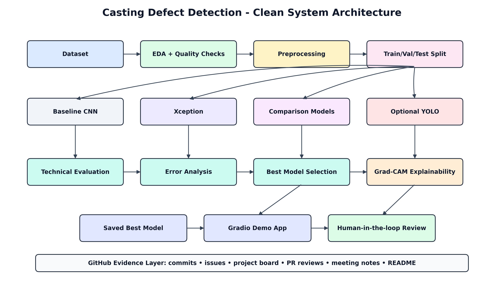

# Automated Casting Defect Detection Using Deep Learning and Computer Vision



**Module Leader:** Royce Copley  
**Level:** 7  
**Module Name:** Advanced Artificial Intelligence Projects in Data Science  
**Module Code:** 55-710603  
**Assignment:** AI Project and Pitch Group Work and Individual Report  
**Submission Format:** Word/PDF report, PowerPoint presentation and complete source code  

---

## 1. Project Aim

This project builds an AI-assisted computer vision system for **casting defect detection**. The system classifies casting product images into two classes:

- `def_front` — defective casting product
- `ok_front` — acceptable casting product

The project combines dataset exploration, deep learning model comparison, Xception transfer learning, final evaluation, Grad-CAM explainability and a Flask/Gradio-style live demo for inspection support.

---

## 2. Problem We Are Solving

Casting is a manufacturing process where liquid material is poured into a mould and allowed to solidify. During production, defects such as blow holes, pinholes, burrs, shrinkage defects, mould material defects, pouring defects and metallurgical defects can occur.

In many casting industries, quality inspection is still carried out manually. This can be time-consuming, dependent on inspector experience, inconsistent under fatigue or high workload, and risky if defective products are missed.

Our project addresses this by creating a deep learning model that can automatically analyse a casting image and predict whether the item is defective or acceptable. The system is designed as **decision support for inspectors**, not as a full replacement for human quality control.

---

## 3. Dataset

The project uses the Kaggle casting product dataset:

**Dataset:** Casting Product Image Data for Quality Inspection  
**Kaggle Link:** https://www.kaggle.com/datasets/ravirajsinh45/real-life-industrial-dataset-of-casting-product

The dataset contains top-view images of submersible pump impellers.

### Dataset Structure

```text
casting_data/
├── train/
│   ├── def_front/
│   └── ok_front/
└── test/
    ├── def_front/
    └── ok_front/
```

### Dataset Details Used in the Full Pipeline

| Split | def_front | ok_front | Total |
|---|---:|---:|---:|
| Train | 3,758 | 2,875 | 6,633 |
| Test | 453 | 262 | 715 |
| **Total** | **4,211** | **3,137** | **7,348** |

The dataset images are grayscale casting images stored and processed as image inputs for CNN models. The dataset also includes a 512×512 unaugmented version with 519 `ok_front` and 781 `def_front` images.

---

## 4. Team Roles

| Member | Role | Main Contribution |
|---|---|---|
| Sandeep Bommagoni | Data & EDA Lead | Dataset source, class distribution, image quality checks and preprocessing evidence |
| Likith Kumar Devulapalli | Architecture / Xception Lead | System architecture, Xception transfer learning and model implementation |
| Raghava Krishna Battu | Model Comparison Lead | Baseline CNN, transfer-learning model comparison and training evidence |
| Navatej Patel Cheerneni | Evaluation, Grad-CAM & Ethics Lead | Final metrics, confusion matrix, Grad-CAM, error analysis and responsible AI |
| Tharun Chinnachinnaiahgari | GitHub, Deployment & Integration Lead | GitHub evidence, README, Flask/Gradio demo and final integration |

---

## 5. System Architecture

The project follows this workflow:

```text
Dataset
↓
EDA + Quality Checks
↓
Preprocessing
↓
Train / Validation / Test Split
↓
Baseline CNN + Xception + Comparison Models
↓
Technical Evaluation
↓
Error Analysis
↓
Best Model Selection
↓
Grad-CAM Explainability
↓
Saved Best Model
↓
Flask / Gradio Demo App
↓
Human-in-the-loop Review
```

The architecture image is stored in:

```text
architecture/Clean_System_Architecture.png
```

GitHub architecture image link:

```text
https://github.com/likith9059/AdvancedArtificial-IntelligenceProjectsinDataScience-55-710603-/blob/main/architecture/Clean_System_Architecture.png
```

---

## 6. AI Techniques Used

| Technique / Model | Purpose |
|---|---|
| Custom CNN | Baseline model trained from scratch |
| MobileNetV2 | Lightweight transfer-learning comparison model |
| EfficientNetB0 | Efficient modern CNN comparison model |
| DenseNet121 | Deeper CNN architecture comparison |
| Xception | Main selected transfer-learning model |
| Grad-CAM | Explainability method to visualise model attention |
| Flask / Gradio-style App | Live demo interface for image upload and prediction |

---

## 7. Final Model and Results

The final selected model was:

```text
Xception_fine_tuned
```

### Final Test Performance

| Metric | Result |
|---|---:|
| Accuracy | 99.86% |
| Precision | 0.9962 |
| Recall | 1.0000 |
| F1-score | 0.9981 |
| AUC | 1.0000 |
| Misclassified images | 1 out of 715 |

The model comparison showed that Xception fine-tuning produced the strongest final performance. However, the project also discusses limitations, including duplicate image entries and the need for external validation before real industrial deployment.

---

## 8. Explainability and Responsible AI

Grad-CAM was used to inspect where the CNN model focused when making predictions. This helps the team evaluate whether the model is looking at meaningful casting regions rather than irrelevant background areas.

Responsible AI considerations include:

- false negatives may allow defective products to pass inspection,
- dataset may not represent every factory, lighting setup or defect type,
- Grad-CAM is helpful but not perfect proof of reasoning,
- human quality inspectors should review uncertain or high-risk cases,
- the system should be treated as an academic decision-support prototype.

---

## 9. Repository Structure

```text
.
├── app.py
├── model_service.py
├── model_metadata.json
├── requirements.txt
├── requirements-dev.txt
├── run_windows.bat
├── setup_windows.bat
├── run_linux_mac.sh
├── Dockerfile
├── Procfile
├── render.yaml
├── runtime.txt
├── DEPLOYMENT_GUIDE.md
├── architecture/
│   └── Clean_System_Architecture.png
├── static/
├── templates/
├── tests/
├── notebooks/
├── reports/
├── project_management/
└── models/
    └── downloaded model file goes here
```

---

## 10. Model Files

Large `.keras` model files are not committed directly to GitHub because they can be too large for normal repository upload.

Download the saved model files from OneDrive and place them inside the `models/` folder.

> **Model Download Link:** PASTE_YOUR_ONEDRIVE_MODEL_LINK_HERE

Recommended model folder structure:

```text
models/
├── casting_defect_best_model.keras
└── model_metadata.json
```

If your downloaded model has a different filename, either rename it to the expected model name or update the model path in `model_service.py`.

---

## 11. Setup Instructions

### 11.1 Recommended Python Version

Use Python 3.11.

```bash
python --version
```

Recommended:

```text
Python 3.11.x
```

TensorFlow may not install correctly on Python 3.13, so Python 3.11 is recommended.

### 11.2 Create Virtual Environment

#### Windows PowerShell

```powershell
python -m venv .venv
.\.venv\Scripts\Activate.ps1
python -m pip install --upgrade pip
pip install -r requirements.txt
```

#### Windows CMD

```cmd
python -m venv .venv
.venv\Scripts\activate.bat
python -m pip install --upgrade pip
pip install -r requirements.txt
```

#### Linux / macOS

```bash
python3 -m venv .venv
source .venv/bin/activate
python -m pip install --upgrade pip
pip install -r requirements.txt
```

---

## 12. How to Run the Flask Demo

After installing the requirements and placing the model file in the `models/` folder, run:

```bash
python app.py
```

Then open the local URL shown in the terminal, usually:

```text
http://127.0.0.1:5000
```

The demo allows the user to:

1. upload a casting image,
2. validate and preprocess the image,
3. run model inference,
4. show `def_front` or `ok_front` prediction,
5. display confidence and probability values,
6. support human inspection decision-making.

---

## 13. How to Run Using Batch Files

On Windows, the repository may include setup and run helper files.

### Setup

```cmd
setup_windows.bat
```

### Run

```cmd
run_windows.bat
```

For Linux/macOS:

```bash
bash run_linux_mac.sh
```

---

## 14. How to Train / Reproduce the Model

The end-to-end modelling notebook is included in the repository.

Recommended notebook workflow:

```text
notebooks/endtoend.ipynb
```

Main notebook stages:

```text
1. Load dataset
2. Perform EDA and data quality checks
3. Build TensorFlow data pipeline
4. Train Custom CNN baseline
5. Train transfer-learning models
6. Compare models
7. Fine-tune Xception
8. Evaluate on test set
9. Generate confusion matrix and classification report
10. Run Grad-CAM explainability
11. Save final model and metadata
```

---

## 15. GitHub Evidence and Project Management

The module requires continuous GitHub evidence. The repository contains evidence for:

- weekly milestones,
- assigned issues,
- closed tasks,
- commits,
- project management tracker,
- meeting notes,
- member contribution files,
- README updates,
- source code and notebook outputs.

The GitHub evidence supports the assessment rule:

> Work that is not documented on GitHub does not exist.

Project evidence is organised in:

```text
project_management/
reports/
notebooks/
architecture/
static/
templates/
tests/
```

---

## 16. Live Demonstration Plan

The group presentation includes a live demonstration.

Demo steps:

1. Open the Flask app.
2. Upload a new casting image.
3. Click the inspection button.
4. Show the model decision: `def_front` or `ok_front`.
5. Show defective probability and OK probability.
6. Explain the confidence threshold.
7. Discuss how the result supports human-in-the-loop quality review.

The demo should be shown live during the pitch and should not rely only on screenshots.

---

## 17. Assessment Learning Outcomes Mapping

| Learning Outcome | How the Project Addresses It |
|---|---|
| LO1 | Explores CNNs, transfer learning, Xception, model comparison and Grad-CAM |
| LO2 | Implements a complete AI pipeline using Python, TensorFlow/Keras and Flask |
| LO3 | Evaluates accuracy, precision, recall, F1-score, AUC, confusion matrix and inference behaviour |
| LO4 | Discusses responsible AI, false negatives, dataset bias, explainability and human oversight |

---

## 18. Limitations

The project has the following limitations:

- the dataset contains augmented and similar images,
- duplicate image entries were detected during EDA,
- performance may be lower on new factory images,
- lighting and camera changes may affect predictions,
- Grad-CAM is supportive but not a complete explanation,
- external validation is required before real production deployment.

---

## 19. Future Work

Future improvements include:

- external validation on new factory images,
- collection of more diverse casting defects,
- defect localisation or segmentation,
- improved Grad-CAM visualisation inside the web app,
- model monitoring and drift detection,
- deployment to a controlled inspection environment,
- human-in-the-loop review dashboard.

---

## 20. References

- Kaggle Dataset: https://www.kaggle.com/datasets/ravirajsinh45/real-life-industrial-dataset-of-casting-product  
- TensorFlow / Keras Documentation: https://www.tensorflow.org/  
- GitHub Repository Architecture Image: https://github.com/likith9059/AdvancedArtificial-IntelligenceProjectsinDataScience-55-710603-/blob/main/architecture/Clean_System_Architecture.png  

---

## 21. Quick Start Summary

```bash
git clone https://github.com/likith9059/AdvancedArtificial-IntelligenceProjectsinDataScience-55-710603-.git

cd AdvancedArtificial-IntelligenceProjectsinDataScience-55-710603-

python -m venv .venv

# Windows PowerShell
.\.venv\Scripts\Activate.ps1

# Install dependencies
pip install -r requirements.txt

# Download model from OneDrive and place it in models/
# Then run the app
python app.py
```

Open:

```text
http://127.0.0.1:5000
```

---

## 22. Final Project Statement

This project demonstrates a complete AI-assisted quality inspection workflow for casting defect detection. It includes dataset understanding, CNN modelling, transfer learning, model comparison, Xception fine-tuning, technical evaluation, explainability, responsible AI discussion, live demo preparation and GitHub-based project management evidence.
